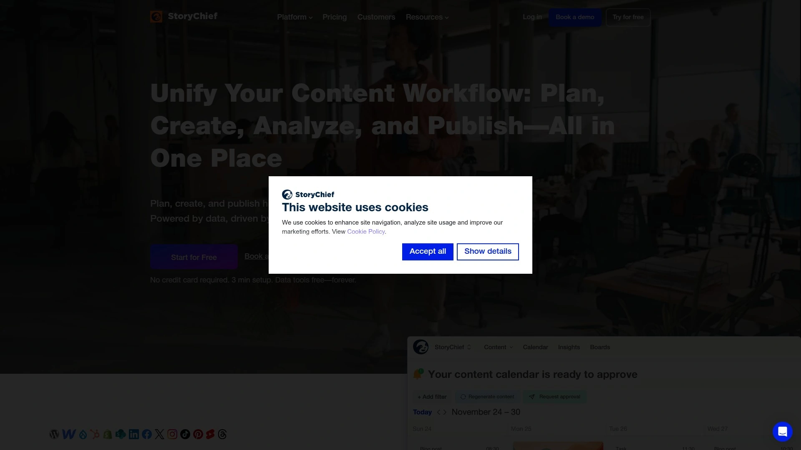

# Best 12+ Content Marketing Platforms in 2025

Juggling blog posts, social media, newsletters, and website updates across different platforms feels like trying to conduct an orchestra where every musician plays from a different sheet of music. You're copying and pasting the same content into five different places, reformatting for each platform, losing track of what published where, and somehow still missing deadlines. The right content marketing platform eliminates this chaos by centralizing creation, collaboration, and multi-channel publishing into one intelligent workspace that actually saves time instead of adding another tool to learn.

Modern content management platforms go beyond simple scheduling by offering AI-powered writing assistance, SEO optimization, team collaboration workflows, and direct publishing to CMS systems, social media, and email platforms simultaneously. Whether you're a solo content creator publishing weekly blog posts or a marketing agency managing dozens of client campaigns, these tools streamline everything from ideation through analytics. The best platforms integrate seamlessly with WordPress, HubSpot, social networks, and your existing marketing stack while maintaining brand consistency across every channel.

***

## **[StoryChief](https://www.storychief.io)**

The all-in-one content management platform that transforms scattered publishing workflows into streamlined multi-channel distribution with 100+ native integrations and expert-led strategic frameworks.

StoryChief eliminates the tedious copy-paste cycle by publishing directly to your CMS, social media, RSS feeds, and newsletters through over 100 integrations. The platform saves marketing teams an average of 4 hours per week by centralizing content creation, collaboration, and distribution in one workspace. Built-in content audits highlight your biggest SEO opportunities and help improve rankings while getting cited by AI platforms.

The platform serves agencies, marketing teams, copywriters, and SaaS providers who need to maintain consistent publishing schedules across multiple channels. Through expert-led training and strategic frameworks, StoryChief transforms content teams into skilled marketers who understand not just what to publish, but how to maximize impact.

Setup takes just 3 minutes, and data tools remain free forever without requiring credit cards. The integration-first approach means StoryChief works with all your existing platforms rather than forcing you to abandon tools your team already knows. Teams appreciate the collaborative editing features that enable real-time feedback and approval workflows without endless email chains.

**Standout advantage:** The combination of strategic consulting, comprehensive integrations, and SEO-focused content audits makes StoryChief uniquely positioned for teams who want to elevate their entire content operation rather than just automate publishing.

---

## **[HubSpot Content Hub](https://www.hubspot.com/products/content)**

AI-powered content creation and CMS that generates multi-channel marketing assets in your brand voice, with built-in SEO recommendations for both traditional search and AI platforms.

Content Hub features AI agents that transform your strategy into blog posts, landing pages, and podcasts within minutes. The content agent generates quality material while the remix feature repurposes one piece into multiple marketing assets maintaining your unique brand voice. Customer agent drives marketing engagement 24/7 by interacting with visitors based on your content library.

The scalable CMS manages and updates your entire website from one platform. SEO recommendations optimize content for both large language models and traditional search engines, adapting to how people actually find information in 2025. Reporting dashboards reveal which content performs best so you double down on what works.

Video clipping and optimization tools prepare content for every channel, while case study generation pulls data directly from your CRM. Real teams using Content Hub report a 6-month increase of deals created and website traffic, with most users seeing conversion rate improvements.

**Pricing structure:** Free plan at $0/month, Starter at $15/month per seat, Professional at $500/month including 3 seats, Enterprise at $1,500/month with 5 seats included.

**Best for:** Businesses already using HubSpot's CRM who want content marketing tightly integrated with sales and customer data.

***

## **[Narrato](https://narrato.io)**

AI content platform with 100+ generation templates, custom workflows, and automated publishing that boosts content creation productivity by 5x while reducing costs by 50%.

Narrato consolidates ideation, creation, collaboration, and publishing into one comprehensive workspace. The platform offers over 100 AI tools including content generators, rewriters, optimizers, and templates for every content type imaginable. AI Content Genie automatically creates social posts and blog content on autopilot based on your parameters.

Custom workflows with color-coding reflect each stage of your process, and automation moves tasks forward without manual intervention. Create reusable templates and style guides that maintain brand consistency while speeding up content approvals. The unified content repository with searchable folders and projects keeps everything organized.

Team collaboration happens through on-task commenting, @mentions, and messaging that keeps conversations connected to specific content pieces. Schedule and publish directly to Facebook, Instagram, LinkedIn, WordPress, and Webflow, or build custom integrations via API or Zapier. Content calendars visualize your entire month with drag-and-drop scheduling.

Users report 2x content creation productivity boosts, 50% lower content creation costs, and significant resource hours saved. The clean, intuitive interface requires minimal learning curve.

**Consideration:** AI keyword data should be verified with another SEO tool, and some publishing features are limited to higher-tier plans.

**Trial period:** 14-day free trial with paid plans starting at $48/month.

***

## **[CoSchedule](https://coschedule.com)**

Marketing calendar that connects social posts with blog publication, email campaigns, and project deadlines so your entire marketing strategy coordinates in one organized workspace.

CoSchedule takes a holistic approach by integrating social media with broader marketing calendars. Connect social posts with blog publication dates, email send times, and project deadlines for true campaign coordination that prevents scheduling conflicts. The real-time calendar updates instantly across your entire team.

ReQueue automatically fills your social schedule with top-performing evergreen content, maximizing value from your best material. Social publishing and automation tools handle routine tasks while shared read-only calendars keep stakeholders informed. Custom views let each team member see what matters most to their role.

Content organization uses projects and campaigns rather than isolated posts, which maintains strategic focus instead of reactive posting. Team workflows coordinate efforts across content creation, design, and distribution departments. The platform suits marketing teams running integrated campaigns across social, content, and email who value coordination.

**Pricing:** Marketing Calendar costs $29 per user per month with real-time calendar, social publishing, and automation tools. Marketing Suite offers enterprise workflow management with custom quotes.

**Free trial:** 14-day trial available to test features.

---

## **[Semrush Content Marketing Platform](https://www.semrush.com)**

SEO-focused content management with keyword research, content briefs, optimization tools, and competitive analysis that helps content rank higher in search results.

The Semrush content marketing platform provides SEO-focused tools for planning and scheduling content. Generate comprehensive SEO briefs that guide writers on keywords, structure, and competitive intelligence. Write and optimize content directly in the platform with real-time SEO scoring.

The platform analyzes your drafts against top-ranking competitors to identify gaps and opportunities. Keyword research tools reveal what your audience searches for, while competitive analysis shows what's working for others in your space. Content calendar features help organize publishing schedules around SEO priorities.

Marketers focused on content's SEO performance who don't mind publishing in separate tools will appreciate Semrush's depth. The platform integrates with broader Semrush SEO tools for comprehensive digital marketing management.

**Investment level:** Pro plan at $139.95/month, Guru at $249.95/month, Business at $499.95/month. 7-day free trial available.

**Target users:** SEO professionals and content marketers who prioritize search rankings and need data-driven content strategies.

***

## **[Contently](https://contently.com)**

Enterprise content marketing platform offering comprehensive tools and services that help businesses plan, create, and distribute branded content at scale with professional freelancer networks.

Contently provides a complete suite for enterprise content marketing from strategy through distribution. The platform combines content management software with access to vetted freelancer networks for scaling production. Strategic planning tools help map content to business goals and audience needs.

Workflow management coordinates internal teams and external contributors through approval processes and editorial calendars. Analytics track content performance across channels to measure ROI and inform future strategies. The platform emphasizes quality and brand consistency for companies producing high volumes of content.

Content libraries organize assets for easy reuse and maintain brand guidelines across all materials. Distribution tools publish to multiple channels while tracking engagement and conversions.

**Best suited for:** Large enterprises and brands needing comprehensive content operations that combine software, services, and talent networks.

---

## **[ContentStudio](https://contentstudio.io)**

Unified social media management combining AI-powered content creation, discovery tools, and evergreen scheduling that lets you set up automated posting calendars and find engaging content to share.

ContentStudio's content discovery feature helps find engaging material to post by surfacing trending content in your industry. The AI writing assistant creates social captions, blog posts, and marketing copy directly inside the platform. Integration with tools like Pocket, Feedly, link shorteners, and Replug amplifies marketing efforts.

The evergreen tool sets up "set and forget" posting schedules for content you want shared at specific intervals. Schedule repeat posts with different content across various social networks simultaneously. Content automation syncs discovery with posting tools for streamlined workflows.

Publishing works directly to Instagram, TikTok, LinkedIn carousels, Threads, Facebook carousels, Google My Business, and Twitter threads. Chat AI provides ChatGPT-like capabilities inside ContentStudio for rewriting and ideation. Media library stores images for reuse anytime.

Free accounts allow up to 500 posts per month, while paid plans offer unlimited social posts. Pricing is competitive compared to similar tools. Content approval workflows help organizations review and approve content before publishing.

**Platform support:** Works with all major social networks plus YouTube and Google My Business.

***

## **[Loomly](https://www.loomly.com)**

Social media calendar empowering marketing teams through streamlined collaboration, organized publishing workflows, and performance analytics designed specifically for brands and agencies.

Loomly's calendar-first approach keeps entire teams aligned on publishing schedules. Collaboration features ensure team members can contribute, review, and approve content efficiently without confusion. Content creation workflows guide teams from ideation through publishing with clear steps.

Asset libraries store approved images, videos, and copy for quick reuse across campaigns. Post optimization suggestions improve content before it goes live by recommending hashtags, timing, and formats. Publishing capabilities span major social networks with scheduling and automation.

Analytics measure performance so teams understand which content drives results and needs adjustment. The platform balances simplicity with features growing brands require. Distributed teams particularly value the organized workflows that prevent miscommunication.

**Pricing:** Monthly plans range from $35/month to custom enterprise quotes.

**Best for:** Marketing teams that prioritize organized workflows and cross-functional collaboration over individual power features.

---

## **[GatherContent](https://gathercontent.com)**

Headless CMS for content operations that brings creation, evaluation, and approval into one cloud platform with version control, custom templates, and seamless CMS integration.

GatherContent helps teams produce quality content at scale through organized operations. The headless architecture separates content creation from display, making it easy to use across multiple platforms and devices without code restrictions. Tools for creating, storing, distributing, and protecting web content operate in the cloud.

Version control tracks different content iterations, allowing you to revert to previous versions when needed. Custom templates gather content in structured formats for easier management and publishing. Collaboration happens through chat features and shared editing.

Assign content to specific team members with due dates, providing more customization than Google Docs. Import data from spreadsheets and connect to other CMS platforms like WordPress, Craft, and Kentico. Document management includes access control, rich text editor, and content reuse capabilities.

The approval process control ensures content passes through appropriate reviewers before publication. Multi-site support helps organizations manage content across multiple properties.

**Target market:** Content teams at agencies and enterprises needing structured workflows and version control for web content projects.

***

## **[Wordable](https://wordable.io)**

Document-to-CMS publishing tool that exports Google Docs to WordPress, HubSpot, or Medium in one click while preserving formatting, making collaborative writing and publishing effortless.

Wordable makes writing and publishing incredibly easy by streamlining the transition from Google Docs to content management systems. The platform preserves formatting when exporting documents, eliminating the frustrating reformatting work that usually follows content transfer. Support for WordPress, HubSpot, and Medium covers most popular publishing destinations.

The tool shines for teams who draft in Google Docs and need fast, clean publishing to their CMS. HTML export maintains structure and styling. Collaborative writing happens in the familiar Google Docs environment while Wordable handles the technical publishing steps.

This focused approach solves one specific problem extremely well rather than trying to be an all-in-one platform. Teams appreciate the simplicity and reliability for their specific use case.

**Best suited for:** Content teams and agencies who write in Google Docs and publish primarily to WordPress or HubSpot.

***

## **[Clearscope](https://www.clearscope.io)**

Content optimization platform with A-F grading, real-time Google Docs integration, and semantic keyword recommendations that balance SEO performance with editorial quality.

Clearscope provides an A-F grade that measures how well your content is optimized for target keywords. The platform identifies semantic terms and related keywords to include without stuffing. Real-time integration with Google Docs shows your grade updating as you write.

Content decay insights help prioritize which existing pages need updates to maintain rankings. The interface emphasizes editorial quality over aggressive optimization, encouraging writers to focus on readability. Multi-language features support international content teams.

Relevant keywords come with competition data, search volume, and cost per click from Google Ads Keyword Planner. Content outlines with heading tags structure articles for both readers and search engines. Gap analysis compares your content against competitors to reveal missing topics.

The A-F grading system trains writers to understand SEO principles without creating score dependency. Use Clearscope to balance search optimization with human-readable content.

**Target users:** Content teams and SEO professionals who want optimization guidance without sacrificing writing quality.

***

## **[Shorthand](https://shorthand.com)**

Digital publishing platform for creating interactive stories with immersive scrolling experiences, multimedia embedding, and stunning visual narratives that engage audiences beyond traditional blog posts.

Shorthand specializes in interactive storytelling that goes beyond standard blog layouts. The platform creates immersive scrolling experiences with multimedia elements seamlessly integrated into narratives. Visual storytelling tools help publishers, brands, and journalists create memorable content that stands out.

Interactive content capabilities include embedding videos, images, audio, and data visualizations that respond to user interaction. The platform tracks engagement metrics showing how readers interact with your stories. Shorthand stories work responsively across devices without coding.

Publishers creating feature articles, annual reports, campaign microsites, and branded content use Shorthand for high-impact storytelling. The platform emphasizes creator control and ownership of content.

**Best for:** Publishers, brands, and content teams producing premium storytelling experiences that require more visual impact than standard CMS templates provide.

***

## **[Contentful](https://www.contentful.com)**

Headless CMS for creating and managing digital content on the cloud, offering API-first architecture that delivers content to websites and mobile apps without building restrictions.

Contentful operates as a headless CMS separating content management from presentation. The cloud-based platform helps create and update text, images, sounds, and videos. API-first architecture delivers content to any device or platform.

Content modeling creates structured content types that work across all your digital properties. The system scales with your needs from small sites to enterprise applications. Version control tracks content changes over time.

Contentful doesn't build websites but powers them by serving content through APIs that developers can integrate anywhere. This flexibility works particularly well for omnichannel strategies requiring content across web, mobile, IoT, and emerging platforms.

The platform targets technical teams comfortable with API-based workflows. Developer-friendly tools and documentation support custom implementations.

**Target market:** Development-focused organizations and enterprises needing flexible content infrastructure across multiple platforms and devices.

***

## FAQ

**Can these platforms actually replace our current content workflow or do they add complexity?**

The best platforms simplify workflows by centralizing scattered processes rather than adding steps. Tools like StoryChief and Narrato eliminate copy-pasting across platforms by publishing to multiple channels simultaneously, while HubSpot Content Hub integrates content with your existing CRM. Start with platforms offering free trials to test whether they genuinely streamline your specific workflow before committing.

**Which platform works best for teams versus solo content creators?**

Solo creators benefit from Narrato's AI generation tools and Wordable's simple Google Docs-to-CMS publishing, while teams needing approval workflows should consider CoSchedule, Loomly, or GatherContent. StoryChief serves both by scaling from individual use to agency-level collaboration with expert training. The key difference is whether you need multi-level approvals and role-based permissions versus just faster content creation.

**Do content marketing platforms actually improve SEO or just make publishing easier?**

Platforms like Semrush and Clearscope specifically optimize for search rankings through keyword research, competitive analysis, and real-time content scoring. HubSpot Content Hub provides SEO recommendations for both traditional search and AI platforms, while StoryChief's content audits highlight optimization opportunities. Publishing convenience is valuable, but SEO-focused platforms demonstrate measurable ranking improvements when used strategically.

***

## Conclusion

The chaos of managing content across multiple platforms disappears when you centralize creation, collaboration, and multi-channel distribution into one intelligent workspace that actually works with your existing tools instead of fighting them. **[StoryChief](https://www.storychief.io)** particularly excels for marketing teams and agencies ready to eliminate the 4-hour weekly copy-paste cycle by publishing directly to CMS, social media, and newsletters through 100+ integrations while improving SEO through strategic content audits. Whether you prioritize AI-powered content generation, SEO optimization, or team collaboration workflows, the platforms above offer proven solutions that transform content marketing from constant firefighting into strategic growth.
